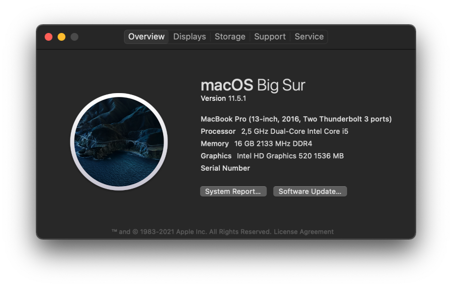

# Hackintosh EFI for Dell Latitude E7470 using OpenCore bootloader.

| **Hardware**  | **Detail**                          |
| ------------- | ----------------------------------- |
| **Model**     | Dell Latitude E7470                 |
| **CPU**       | Intel Core i5 6300U 2.4GHz          |
| **GPU**       | Intel HD Graphics 520               |
| **Display**   | 14" 1920x1080                       |
| **Memory**    | 2 x 8GB DDR4 2133MHz                |
| **Audio**     | Realtek ALC293                      |
| **Ethernet**  | Intel Ethernet Connection I219-LM   |
| **Wifi card** | Intel Dualband Wireless-AC 8260     |
| **Touchpad**  | Alps muti-touch v8                  |
| **Storage**   | KimMiDi MBW-T900 256GB M.2 SATA SSD |

[Dortania's OpenCore Install Guide](https://dortania.github.io/OpenCore-Install-Guide/)
